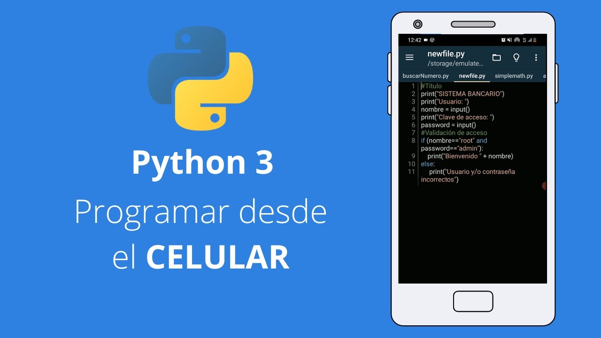

# ClaseDosJorge

#### Autor: JORGE CIFUENTES GUZMÁN

## Título Dos

### Título tres

Creación de repositorios y manejo de MarkDown

- Versión 1
- Versión 2

## Tabla

| Encabezado 1 | Encabezado 2 | Encabezado 3 |
| ------------ | ------------ | ------------ |
| Texto 1      | Texto 2      | Texto 3      |
| Texto 4      | Texto 5      | Texto 6      |

```markdown
_cursiva_
**negrita** o **negrita**
**_negrita cursiva_** o **_negrita cursiva_**
```

## Listas

- lista no ordenada

1. lista ordenada

```markdown
- lista no ordenada

1. lista ordenada
```

## Enlaces

```markdown
[Google](https://www.google.com)
```

## Imágenes

<p align="center">

</p>

## Código

`código en línea`

```python
def hola_mundo():
    print("Hola, mundo!")
```

## Citas

> Esto es una cita.

## Listas de tareas

- [x] Tarea completada
- [ ] Tarea pendiente

## Líneas horizontales

---

o

---
