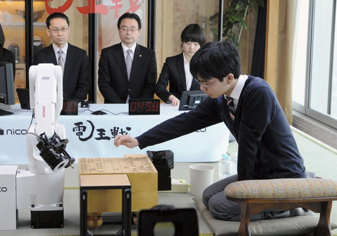

# 
**IMPACTO Y LAS PERSPECTIVAS DE LA INTELIGENCIA ARTIFICIAL**

#### **_Autor: JORGE CIFUENTES GUZMÁN; Estudiante TALENTO TECH, Abril 2024_**

## **INTRODUCCIÓN**

ALa inteligencia artificial (IA) ha pasado de ser un concepto futurista a una realidad presente que transforma diversas industrias y aspectos de la vida cotidiana. Desde su concepción hasta sus desarrollos más recientes, la IA ha experimentado un viaje fascinante lleno de avances tecnológicos y desafíos éticos. En este artículo, exploraremos la historia, aplicaciones actuales, desafíos éticos, avances recientes y proyecciones futuras de la inteligencia artificial. 

## **HISTORIA Y EVOLUCIÓN DE LA INTELIGENCIA ARTIFICIAL**

Durante los últimos tres siglos, se suele hablar de tres grandes revoluciones industriales. La primera vinculada al desarrollo del ferrocarril y al motor de vapor para mecanizar la producción. La segunda relacionada a la energía eléctrica y la cadena de montaje para desarrollar la producción en masa. La tercera revolución se ubica a partir del surgimiento de la electrónica, los ordenadores y la tecnología de la información para automatizar la producción1. Actualmente transitamos una nueva revolución que se vincula con varios fenómenos (nanotecnología, biotecnología, robótica, internet de las cosas, impresión 3d)2. El más disruptivo de todos, es producto del desarrollo de la inteligencia artificial, que se presenta como una innovación vinculada a los avances tecnológicos relacionados con el procesamiento de información y de los datos (también en esta área se encuentran otras invenciones del siglo pasado como el ordenador, internet, la world wide web -www-, los motores de búsqueda, etc.). La “Cuarta Revolución Industrial”3 tiene su epicentro en el aumento exponencial de dos factores: capacidad de almacenamiento y velocidad de procesamiento de la información y de los datos.

Aunque no seamos muy conscientes, estamos atravesando una época inédita en la historia humana. Entre muchísimas otras razones, esto se debe a que asistimos a la progresiva eliminación de las barreras de comprensión de otras lenguas casi instantáneamente, a partir del desarrollo exponencial del sistema de inteligencia artificial.

1. La historia de la inteligencia artificial se remonta a la década de 1940, con el desarrollo de las primeras redes neuronales artificiales por McCulloch y Pitts.
2. La Conferencia de Dartmouth en 1956 marcó el inicio oficial de la IA como campo de estudio.
3. Hitos como el Perceptrón de Rosenblatt en 1959 y el desarrollo de Shakey el Robot en 1969 demostraron avances tempranos en el campo.
4. El boom de la IA en la década de 1980 y el renacimiento del interés en la década de 2000, con el surgimiento del aprendizaje profundo, han llevado a importantes avances en la IA.

#### 
 _Imágen No. 1 Cronología del desarrollo de la Inteligencia Artificial_

## **APLICACIONES ACTUALES DE LA INTELIGENCIA ARTIFICIAL**

• La IA se utiliza en una amplia gama de industrias, incluyendo salud, finanzas, transporte, educación y más.
• Ejemplos destacados incluyen sistemas de diagnóstico médico asistido por IA, algoritmos de trading financiero, vehículos autónomos y asistentes virtuales.

## **DESAFÍOS Y ÉTICA EN LA INTELIGENCIA ARTIFICIAL**

Ahora bien, la comprensión de un fenómeno como este, requiere abordar brevemente el concepto de inteligencia humana con el que trabajan los expertos en ciencias cognitivas. 
Entre varias definiciones o concepciones del concepto inteligencia, el elemento común es la capacidad de procesar información para resolver problemas en función de alcanzar objetivos6. La noción de inteligencia, está indisolublemente ligada al procesamiento de información. Es importante aclarar que hablamos de información en sentido amplio y bajo el enfoque de las ciencias cognitivas, que aluden al procesamiento de información o al flujo de información del entorno que se codifica, organiza, selecciona, almacena y recupera por medio de los sistemas sensoriales, perceptivos, etc. La inteligencia humana se relaciona con una serie de capacidades o cualidades cognitivas relativamente autónomas que suelen clasificarse en “perfiles de inteligencia” o “inteligencias múltiples”. Ellas son: inteligencia social, inteligencia lingüística (o musical), inteligencia lógico-matemática, inteligencia interpersonal, e intrapersonal o emocional, inteligencia fluida, entre otras.

#### _Imágen No. 2 Masayuki Toyoshima, jugador profesional de shogi, el ajedrez japonés, juega contra el programa de ordenador YSS, que mueve las piezas mediante un brazo robótico. Osaka, Japón, marzo de 2014._

Extraído de: [Google](https://https://www.bbvaopenmind.com/articulos/el-futuro-de-la-ia-hacia-inteligencias-artificiales-realmente-inteligentes/)

Básicamente, nuestro cerebro controla la capacidad para procesar la información proveniente del entorno y de nuestro propio cuerpo7 que se utiliza para evaluar y elegir futuros cursos de acción. Y aquí entra en escena el proceso de toma de decisiones y la evaluación, que consiste en seleccionar, recortar y organizar la información disponible.
A partir de la inteligencia humana, se han desarrollado múltiples y diversas innovaciones tecnológicas. La que aquí nos ocupa tiene que ver con el procesamiento de la información para resolver problemas y tomar decisiones a partir de máquinas que operan a través de los llamados algoritmos inteligentes. La inteligencia artificial (en adelante, también IA) se sustenta en algoritmos inteligentes o en algoritmos de aprendizaje que, entre muchos otros fines, se utilizan para identificar tendencias económicas, predecir delitos, diagnosticar enfermedades, predecir nuestros comportamientos digitales, etc. Un algoritmo puede ser definido como un conjunto preciso de instrucciones o reglas, o como una serie metódica de pasos que puede utilizarse para hacer cálculos, resolver problemas y tomar decisiones. El algoritmo es la fórmula que se emplea para hacer un cálculo.
A medida que la IA se vuelve más ubicua, surgen preocupaciones éticas relacionadas con la privacidad, los sesgos algorítmicos, el desempleo y la responsabilidad social.
La regulación y la implementación de estándares éticos son fundamentales para abordar estos desafíos y garantizar un desarrollo responsable de la IA.

> [!JOHN MCCARTHY]
>
> _"La inteligencia artificial ofrece enormes beneficios, pero también plantea desafíos éticos significativos que deben abordarse de manera proactiva." - John McCarthy, pionero en IA"_

En este contexto, y en la interpretación de la inteligencia humana, históricamente se han desarrollado inteligencias artificiales, las cuales han servido como base para la nueva revolución, la cual permiten generar diferentes conocimientos y ser aplicadas den diferentes campos, tales como se miran a continuación.

## Tabla

| Item | Nombre                        | Año  | Tipo                    | Funcionalidad                                                                                                          |
| ---- | ----------------------------- | ---- | ----------------------- | ---------------------------------------------------------------------------------------------------------------------- |
| 1    | Redes Neuronales              | 1943 | Aprendizaje Profundo    | Modelado no lineal de relaciones complejas, utilizado en reconocimiento de patrones, procesamiento de imágenes, etc.   |
| 2    | Lógica Difusiva               | 1965 | Simbólica               | Modelado de incertidumbre y toma de decisiones en entornos imprecisos, utilizado en control de sistemas y diagnóstico. |
| 3    | Máquinas de Soporte Vectorial | 1992 | Aprendizaje Supervisado | Clasificación y regresión en conjuntos de datos complejos, utilizado en reconocimiento de texto, bioinformática, etc.  |
| 4    | Algoritmos Genéticos          | 1950 | Evolutiva               | Optimización y búsqueda heurística, utilizado en diseño de sistemas, planificación y selección de características.     |
| 5    | Redes Bayesianas              | 1986 | Probabilística          | Modelado de relaciones probabilísticas entre variables, utilizado en diagnóstico médico, análisis de riesgos, etc.     |

## **AVANCES RECIENTES Y PROYECCIONES FUTURAS**

En años recientes, avances como AlphaGo de Google DeepMind, GPT-3 de OpenAI y AlphaFold de DeepMind han demostrado el potencial transformador de la IA en áreas como los juegos, el procesamiento del lenguaje natural y la biología computacional.
Se espera que la IA continúe avanzando rápidamente, con aplicaciones cada vez más sofisticadas en campos como la medicina, la robótica, la sostenibilidad y más.
Ahora bien, durante las últimas décadas, se han utilizado diferentes métodos para desarrollar algoritmos utilizando grandes volúmenes de datos e información (algunos métodos son: redes neuronales, algoritmos genéticos, aprendizaje por refuerzo, entre otros). En esencia, a partir de la aplicación de IA se busca que las tecnologías permitan que los sistemas computacionales adquieran: autodependencia, reconfiguración autoadaptativa, negociación inteligente, comportamiento de cooperación, supervivencia con intervención humana reducida9, entre otros rasgos. Y todo esto, supone la utilización de diferentes técnicas que se basan en el reconocimiento de patrones a fin de resolver problemas10, maximizar objetivos y optimizar el procesamiento de información. Algunos ejemplos para dimensionar cómo trabajan los sistemas más exitosos de IA son el traductor de Google y Watson (2011)
El traductor de Google y Watson, son dos ejemplos entre muchísimos otros que dan cuenta del Tsunami de inteligencia artificial que se está desarrollando en múltiples campos. Hablamos de sistemas que crean música, pintan cuadros, reconocen caras, objetos, predicen empresas exitosas en la bolsa, detectan enfermedades, ayudan a proteger el ambiente, entre muchísimas otros. Asistimos a una verdadera carrera por desarrollar IA para simplificar y optimizar diversas actividades humanas.

## Tabla

| Item | Nombre | Fución                                                                                                                                                                                                                                |
| ---- | ------ | ------------------------------------------------------------------------------------------------------------------------------------------------------------------------------------------------------------------------------------- |
| 1    | GPT3   | GPT-3 Generative Pre-trained Transformer 3 es un modelo de lenguaje desarrollado por OpenAI que cuenta con 175 mil millones de parámetros y es conocido por su capacidad para generar texto coherente en una variedad de contextos.   |
| 2    | BERT   | BERT (Bidirectional Encoder Representations from Transformers) es un modelo de lenguaje preentrenado desarrollado por Google que ha demostrado excelentes resultados en una variedad de tareas de procesamiento del lenguaje natural. |
| 3    | ALEXA  | Alexa es el asistente virtual desarrollado por Amazon que utiliza inteligencia artificial para comprender y responder a las consultas de los usuarios, realizar tareas y controlar dispositivos inteligentes en el hogar.             |
| 4    | SIRI   | Siri es el asistente virtual desarrollado por Apple que utiliza IA para realizar tareas como enviar mensajes, realizar llamadas, programar recordatorios y responder preguntas de los usuarios.                                       |
| 5    | WATSON | Watson es un sistema de inteligencia artificial desarrollado por IBM que ha sido utilizado en una variedad de aplicaciones, incluyendo análisis de datos, diagnóstico médico, atención al cliente y más.                              |

## 
**CONCLUSIONES**

- En general, La inteligencia artificial ha recorrido un largo camino desde sus inicios hasta la actualidad, y su impacto en la sociedad sigue creciendo. Si bien ofrece numerosas oportunidades para mejorar nuestras vidas y abordar desafíos complejos, también plantea importantes cuestiones éticas que requieren atención continua. Con una regulación adecuada y un enfoque ético, la IA tiene el potencial de beneficiar a la humanidad de formas aún no imaginadas.
- Una primera conclusión se puede asociar desde un lado beneficioso de la IA “el lado luminoso de la inteligencia artificial”. Aquí, esta tecnología es drásticamente disruptiva para hacer efectivos ciertos derechos y, a la vez, representa un salto cualitativo en la forma en la que se podrían gestionar las organizaciones y sus relaciones con los ciudadanos.
- La segunda conclusión se vincula con lo que denominamos “el lado oscuro de la IA”. Desde esta perspectiva, es importante poner el acento en los riesgos que se generan a partir del llamado riesgo existencial vinculado a la posibilidad de que los seres humanos pierdan el control sobre los sistemas de inteligencia artificial. Pero dejando de lado esta cuestión extremadamente compleja que se proyecta a mediano y largo plazo, es preciso abordar otros aspectos relacionados con el corto plazo. Por ejemplo, las cuestiones vinculadas al impacto que se produce a partir del desarrollo y uso de sistemas de IA sobre los derechos fundamentales de las personas. En los puntos siguientes, destacaremos algunas breves propuestas en torno a ambos ejes.

## 
**REFERENCIAS**

- Corvalán, Gustavo, (2017). Inteligencia artificial: retos, desafíos y oportunidades - Prometea: la primera inteligencia artificial de Latinoamérica al servicio de la Justicia, Universidad de Buenos Aires (Argentina) juancorvalan@derecho.uba.ar, Profesor de Derecho Administrativo de la Universidad de Buenos Aires (Buenos Aires, Argentina). Extraído de: [Google] (https://doi.org/10.5380/rinc.v5i1.55334)
- McCulloch, W., & Pitts, W. (1943). A Logical Calculus of Ideas Immanent in Nervous Activity. Bulletin of Mathematical Biophysics, 5(4), 115–133.
- McCarthy, J., Minsky, M., Rochester, N., & Shannon, C. (1955). A Proposal for the Dartmouth Summer Research Project on Artificial Intelligence. AI Magazine, 27(4), 12-14.
- Silver, D., et al. (2016). Mastering the game of Go with deep neural networks and tree search. Nature, 529(7587), 484–489.
- Brown, T., et al. (2020). Language models are few-shot learners. Advances in Neural Information Processing Systems, 33.
